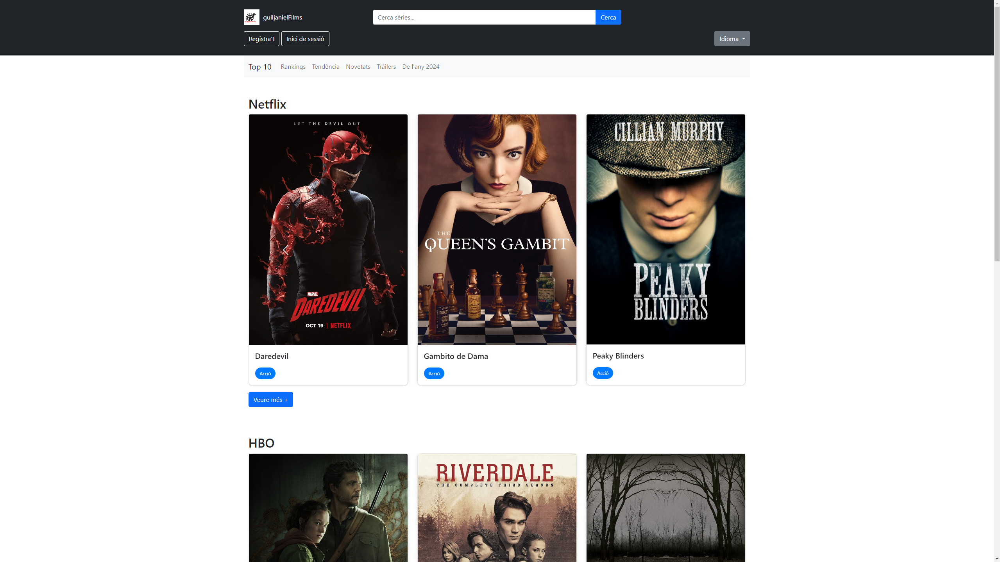

# Steps to install

1. **Clone the repository**
    ```
    git clone https://github.com/tempestgf/Films.git
    ```

2. **Login as mysql root**
    ```
    mysql -u root -p
    ```

3. **Create the database named resenas_series**
    ```
    CREATE DATABASE resenas_series;
    EXIT;
    ```

4. **Import the database**
    ```
    mysql -u username -p resenas_series < resenas_series.sql
    ```

5. **Create user films with password films and grant privileges on the database resenas_films**
    ```
    CREATE USER 'films'@'%' IDENTIFIED BY 'films';
    GRANT ALL PRIVILEGES ON resenas_series.* TO 'films'@'%';
    ```

6. **Install Flask, mysql.connector (Werkzeug not implemented yet)**
    ```
    pip install flask mysql-connector-python werkzeug
    ```

7. **Execute `flask run` in the same directory, or `python app.py`**


Get in with HTTP, HTTPS is not working


